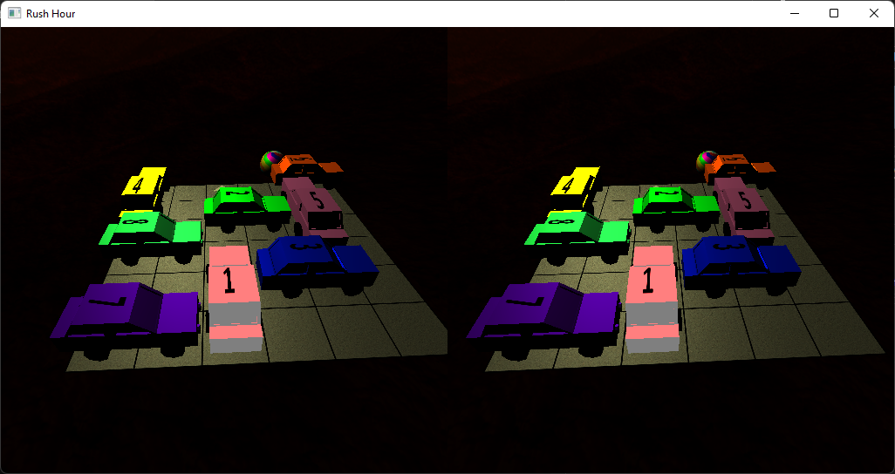
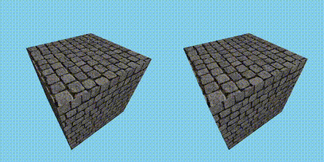

# MyEngineVR

An OpenGL game engine library for VR applications.



MyEngineVR is a game engine library written in C++ that allows you to easily
create games using OpenGL with support for virtual reality through OpenVR.

Besides the game engine itself, this project also contains a playable demo of
the Rush Hour game.

**Note that the game engine requires the use of a virtual reality headset; it
does not work without.**

**This project was developed as part of my university's curriculum and is
complete. At this moment, I do not plan on working on it further.**

Authors:
* [Lorenzo A. P. (JollyCookie2000)](https://github.com/JollyCookie2000)
* [Bruno M. P. G. (KibouToZetsubou)](https://github.com/KibouToZetsubou)
* [Patrick S. (patrick-sartori)](https://github.com/patrick-sartori)

## Repository structure

* `/client/`: A demo project in the form of the Rush Hour game.
* `/dependencies/`: The Windows dependencies required to build the project
  using Visual Studio.
* `/engine/`: The source code for the game engine library.
* `/game.sln`: The Visual Studio 22 solution for building both the
  demo and the game engine library.
* `game.workspace`: The Code::Blocks workspace for building
  both the demo and the game engine library.

## Build

These instructions are for only building the engine. For building the demo
project, see the dedicated section.

The following development libraries are required:
* FreeGLUT 3.4.0
* FreeImage 3.18.0
* GLEW 2.1.0
* GLM 1.0.1
* [SteamVR 2.5.1](https://store.steampowered.com/app/250820/SteamVR/)
* C++ 14

### Windows

The Windows dependencies are already included in the repository inside the
`/dependencies/` directory.

Building on Windows requires Visual Studio 2022.

1. Open the `game.sln` solution file in the root of the repository.
2. Make sure that the *x64* platform is selected.
3. Choose a configuration between *Debug* or *Release*.
4. Right click on the *engine* project and select *Build*.
5. The include files for the game engine library are in the `/engine/`
   directory.
6. The built library files (lib and DLL) are in the `/x64/Debug/` directory.

### Linux

Building on Linux requires Code::Blocks.

1. On Fedora 41, use the following command to install the dependencies:
   `sudo dnf install freeglut-devel freeimage-devel glew-devel glm-devel`.
2. Open the `game.workspace` workspace file in the root of the repository.
3. Choose a build target between *Debug* or *Release*.
4. Right click on the *engine* project and select *Build*.
5. The built library files (SO) are in the `/engine/bin/Debug/libengine.so`
   directory.

### Documentation

The documentation for the engine library can be generated with Doxygen using
the following command: `doxygen ./engine/doxygen.conf`. The generated HTML and
LaTeX documentation will be placed in the `/doc/` directory.

## Demo

The Windows dependencies are already included in the repository inside the
`/dependencies/` directory.

Building on Windows requires Visual Studio 2022.

SteamVR is required to run the demo. It can be downloaded through Steam
[here](https://store.steampowered.com/app/250820/SteamVR/).

A VR headset is required. It is possible to use
[ALVR](https://github.com/alvr-org/ALVR) and
[PhoneVR](https://github.com/PhoneVR-Developers/PhoneVR) to turn an Android
phone into a VR headset.

1. Open the `game.sln` solution file in the root of the repository.
2. Make sure that the *x64* platform is selected.
3. Choose a configuration between *Debug* or *Release*.
4. Right click on the *client* project and select *Set as Startup Project*.
5. Run the solution with or without debug mode.

Inside the demo, you can use the following keys:
* *B*, *N* and *M* to switch between levels.
* *W*, *A*, *S* and *D* to move the highlighted car.
* *1* to *9* to select a car.
* *I* to change camera position.

## Usage

The easiest way to use this game engine library is to modify the included demo
project.

Known bugs:
* Having no light sources in the scene crashes the game engine.

## Example

```C++
#include <iostream>
#include <memory>

#include <material.hpp>
#include <mesh.hpp>
#include <my_engine.hpp>
#include <node.hpp>
#include <perspective_camera.hpp>
#include <point_light.hpp>
#include <texture.hpp>

int main(int argc, char* argv[]) {
    MyEngine::init("Demo", 800, 400);
    MyEngine::set_sky_color(0.53f, 0.81f, 0.92f);

    const auto bricks_texture = std::make_shared<Texture>("./bricks.jpg");
    const auto bricks_material = std::make_shared<Material>();
    bricks_material->set_texture(bricks_texture);

    const std::vector<glm::vec3> vertices = {
        { -0.5f, -0.5f,  0.5f },
        { -0.5f, -0.5f, -0.5f },
        {  0.5f, -0.5f, -0.5f },
        {  0.5f, -0.5f,  0.5f },
        { -0.5f,  0.5f,  0.5f },
        {  0.5f,  0.5f,  0.5f },
        {  0.5f,  0.5f, -0.5f },
        { -0.5f,  0.5f, -0.5f },
        {  0.5f, -0.5f,  0.5f },
        {  0.5f, -0.5f, -0.5f },
        {  0.5f,  0.5f, -0.5f },
        {  0.5f,  0.5f,  0.5f },
        { -0.5f, -0.5f, -0.5f },
        { -0.5f, -0.5f,  0.5f },
        { -0.5f,  0.5f,  0.5f },
        { -0.5f,  0.5f, -0.5f },
        { -0.5f, -0.5f,  0.5f },
        {  0.5f, -0.5f,  0.5f },
        {  0.5f,  0.5f,  0.5f },
        { -0.5f,  0.5f,  0.5f },
        {  0.5f, -0.5f, -0.5f },
        { -0.5f, -0.5f, -0.5f },
        { -0.5f,  0.5f, -0.5f },
        {  0.5f,  0.5f, -0.5f }
    };
    const std::vector<uint32_t> faces = {
        0, 1, 2,
        2, 3, 0,
        4, 5, 6,
        6, 7, 4,
        8, 9, 10,
        10, 11, 8,
        12, 13, 14,
        14, 15, 12,
        16, 17, 18,
        18, 19, 16,
        20, 21, 22,
        22, 23, 20
    };
    const std::vector<glm::vec3> normals = {
        {  0.0f, -1.0f,  0.0f },
        {  0.0f, -1.0f,  0.0f },
        {  0.0f, -1.0f,  0.0f },
        {  0.0f, -1.0f,  0.0f },
        {  0.0f,  1.0f,  0.0f },
        {  0.0f,  1.0f,  0.0f },
        {  0.0f,  1.0f,  0.0f },
        {  0.0f,  1.0f,  0.0f },
        {  1.0f,  0.0f,  0.0f },
        {  1.0f,  0.0f,  0.0f },
        {  1.0f,  0.0f,  0.0f },
        {  1.0f,  0.0f,  0.0f },
        { -1.0f,  0.0f,  0.0f },
        { -1.0f,  0.0f,  0.0f },
        { -1.0f,  0.0f,  0.0f },
        { -1.0f,  0.0f,  0.0f },
        {  0.0f,  0.0f,  1.0f },
        {  0.0f,  0.0f,  1.0f },
        {  0.0f,  0.0f,  1.0f },
        {  0.0f,  0.0f,  1.0f },
        {  0.0f,  0.0f, -1.0f },
        {  0.0f,  0.0f, -1.0f },
        {  0.0f,  0.0f, -1.0f },
        {  0.0f,  0.0f, -1.0f }
    };
    const std::vector<glm::vec2> uvs = {
        { 1.0f, 0.0f },
        { 1.0f, 1.0f },
        { 0.0f, 1.0f },
        { 0.0f, 0.0f },
        { 0.0f, 0.0f },
        { 1.0f, 0.0f },
        { 1.0f, 1.0f },
        { 0.0f, 1.0f },
        { 0.0f, 0.0f },
        { 1.0f, 0.0f },
        { 1.0f, 1.0f },
        { 0.0f, 1.0f },
        { 0.0f, 0.0f },
        { 1.0f, 0.0f },
        { 1.0f, 1.0f },
        { 0.0f, 1.0f },
        { 0.0f, 0.0f },
        { 1.0f, 0.0f },
        { 1.0f, 1.0f },
        { 0.0f, 1.0f },
        { 0.0f, 0.0f },
        { 1.0f, 0.0f },
        { 1.0f, 1.0f },
        { 0.0f, 1.0f }
    };
    const auto cube = std::make_shared<Mesh>(vertices, faces, normals, uvs);
    cube->set_material(bricks_material);
	
    const auto light = std::make_shared<PointLight>();
    light->set_position({ 0.0f, 2.0f, 2.0f });
    light->set_ambient_color({ 0.1f, 0.1f, 0.1f });
	
    const auto camera = std::make_shared<PerspectiveCamera>();
    camera->set_position({ 0.0f, 0.0f, 2.0f });
	
    const auto root_node = std::make_shared<Node>();
	
    root_node->add_child(light);
    root_node->add_child(cube);
    root_node->add_child(camera);

    MyEngine::set_scene(root_node);
    MyEngine::set_active_camera(camera);

    MyEngine::set_keyboard_callback([](
                const unsigned char key,
                const int mouse_x,
                const int mouse_y) {
        if (key == 27) { // ESC
            MyEngine::stop();
        }
    });

    float cube_y_rotation = 0.0f;

    while (MyEngine::is_running()) {
        MyEngine::update();

        cube->set_rotation({ 0.0f, cube_y_rotation, 0.0f });
        cube_y_rotation += 1.0f;

        MyEngine::clear_screen();
        MyEngine::render();
        MyEngine::swap_buffers();
    }

    MyEngine::quit();

    return 0;
}
```


